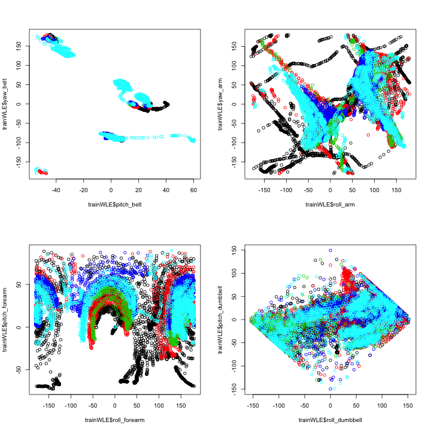
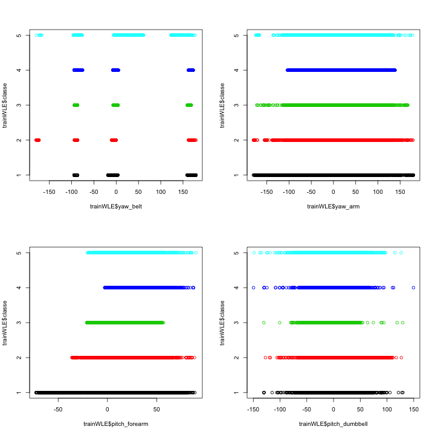

  
###Introduction/Problem  
  
The Weight Lifting Exercise (WLE) dataset is described in Velloso, E.; Bulling, A.; 
Gellersen, H.; Ugulino, W.; Fuks, H. *Qualitative Activity Recognition of Weight Lifting Exercises.* 
**Proceedings of 4th International Conference in Cooperation with SIGCHI** 
(Augmented Human '13) . Stuttgart, Germany: ACM SIGCHI, 2013 and also at the 
HAR website, http://groupware.les.inf.puc-rio.br/har.  
The dataset was created as a challenge for human activity recognition; using 4
physical motion monitors, could an algorithm learn to sort out correct from 
incorrect bicep curls? The 6 participants carefully performed correct bicep curls
and also 4 different standardized kinds of wrong bicep curls, under the guidance
of trainers, so the dataset is intentionally well-sorted and well-separated.
  
###Housekeeping, downloading, data acquisition (cleaning and splitting into 
###training and test components)  
  
This code loads required libraries, downloads the file, reads it into a data table,
cleans and reduces the data table to a more manageable size, and finally splits 
the data table into training and test components.
  
####housekeeping


```r
#ensures required packages in place
suppressMessages(require("data.table")); suppressMessages(require("RGtk2"))
suppressMessages(require("lattice")); suppressMessages(require("plyr"))
suppressMessages(require("grid"));suppressMessages(require("ggplot2")); suppressMessages(require("GGally"))
suppressMessages(require("dplyr")); suppressMessages(require("klaR"));
suppressMessages(require("MASS")); suppressMessages(require("caret"))
```
  
####download and read data into WLEData
  

```r
DataCatcher<-tempfile()
download.file("https://d396qusza40orc.cloudfront.net/predmachlearn/pml-training.csv",
              "./DataCatcher",
              "curl")
WLEData<-data.table()
WLEData<-read.table(file="./DataCatcher",
                    header=TRUE,
                    sep=",")
```
  
####cleaning and reduction of dataset
  
Examination of data via View(WLEData)shows what appear to be observations with
summary statistics (which of course would only apply to a group of observations)
about every 23-26 lines. The suspected "summary statistic" columns are otherwise empty. The
usual values in the summary lines are consistent with being the mean of the prior
set of observations.  
  
Kurtosis, skew, and other summary statistic measures seem very
unlikely to be good predictors of classe, so in the cleaning operation that follows,
those columns are deleted (this also removes an enormous number of NAs along
with any need to do anything about them).  
  
I also decided to remove the rows containing summaries.  Although they were only
2.1%  of all observations, since they were just means of prior real observations,
they would reduce the variances slightly. Variance, in turn, might play a part in
the decisions the program will make, so it seemed best to leave them undistorted. 
Rows containing summaries were
removed using the KeepNoSummaries logical vector.
  

```r
KeepNoSummaries<-is.na(WLEData[,18]) #using first convenient index column
WLEData<-WLEData[KeepNoSummaries,c(1:11,37:49,60:68,84:86,102,113:124,140,151:160)] #col numbers identified by inspection
```

####setting seed and splitting into test and training sets
  

```r
set.seed(3091)
#split into a training and test set
inTrain <- createDataPartition(y=WLEData$classe,p=0.8, list=FALSE)
trainWLE <- WLEData[inTrain,]
testWLE <- WLEData[-inTrain,]
```
  
###First approach: principal components for each monitor/error combination  

It seemed reasonable that incorrect form with throwing the elbow forward (B) would express primarily on the arm monitor; that incorrect form in not going all the way up (C) or all the way down (D) would express in the forearm and dumbell monitors; and that throwing the hips forward would express primarily in the belt monitor.  

Some preliminary EDA seemed to confirm this argument. First I looked to see whether there were any highly correlated variables (defined by correlation of 80% or higher), and there were quite a few: 


```r
#test for highly correlated raw variables, determine how many pairs of them are in data set.
M <- abs(cor(trainWLE[,8:59]))
diag(M) <- 0
PairsHighlyCorrelated<-nrow(which(M > 0.8,arr.ind=T))/2
PairsHighlyCorrelated
```

```
## [1] 19
```
  
As a preliminary estimate, since there were only 52 independent raw variables, 
then, a PCA should be able to reduce the total number of variables to 52-38=14,
14+19=33 or fewer.  
  
Furthermore, closer examination of the matrix of correlations led to this 
table, which seemed to confirm the hypothesis:


```r
VariableNamesVector<-as.character(colnames(M))

VariableCombos2Inspect<-data.frame()
NameAndCorrelates<-data.frame()

for (i in 1:length(VariableNamesVector)) {
                DimensionName<-VariableNamesVector[i]
                SelectCorrelates<-M[1:52,i]>=.8
                CorrelatesVector<-VariableNamesVector[SelectCorrelates]
                Correlates<-paste0(CorrelatesVector,collapse=",")
                NameAndCorrelates<-cbind(DimensionName,Correlates)
                names(NameAndCorrelates)<-c("Variable","CorrelatesList")
                VariableCombos2Inspect<-rbind(VariableCombos2Inspect,NameAndCorrelates)
}
print(VariableCombos2Inspect)
```

```
##           DimensionName
## 1             roll_belt
## 2            pitch_belt
## 3              yaw_belt
## 4      total_accel_belt
## 5          gyros_belt_x
## 6          gyros_belt_y
## 7          gyros_belt_z
## 8          accel_belt_x
## 9          accel_belt_y
## 10         accel_belt_z
## 11        magnet_belt_x
## 12        magnet_belt_y
## 13        magnet_belt_z
## 14             roll_arm
## 15            pitch_arm
## 16              yaw_arm
## 17      total_accel_arm
## 18          gyros_arm_x
## 19          gyros_arm_y
## 20          gyros_arm_z
## 21          accel_arm_x
## 22          accel_arm_y
## 23          accel_arm_z
## 24         magnet_arm_x
## 25         magnet_arm_y
## 26         magnet_arm_z
## 27        roll_dumbbell
## 28       pitch_dumbbell
## 29         yaw_dumbbell
## 30 total_accel_dumbbell
## 31     gyros_dumbbell_x
## 32     gyros_dumbbell_y
## 33     gyros_dumbbell_z
## 34     accel_dumbbell_x
## 35     accel_dumbbell_y
## 36     accel_dumbbell_z
## 37    magnet_dumbbell_x
## 38    magnet_dumbbell_y
## 39    magnet_dumbbell_z
## 40         roll_forearm
## 41        pitch_forearm
## 42          yaw_forearm
## 43  total_accel_forearm
## 44      gyros_forearm_x
## 45      gyros_forearm_y
## 46      gyros_forearm_z
## 47      accel_forearm_x
## 48      accel_forearm_y
## 49      accel_forearm_z
## 50     magnet_forearm_x
## 51     magnet_forearm_y
## 52     magnet_forearm_z
##                                             Correlates
## 1  yaw_belt,total_accel_belt,accel_belt_y,accel_belt_z
## 2                           accel_belt_x,magnet_belt_x
## 3                                            roll_belt
## 4                  roll_belt,accel_belt_y,accel_belt_z
## 5                                                     
## 6                                                     
## 7                                                     
## 8                             pitch_belt,magnet_belt_x
## 9              roll_belt,total_accel_belt,accel_belt_z
## 10             roll_belt,total_accel_belt,accel_belt_y
## 11                             pitch_belt,accel_belt_x
## 12                                                    
## 13                                                    
## 14                                                    
## 15                                                    
## 16                                                    
## 17                                                    
## 18                                         gyros_arm_y
## 19                                         gyros_arm_x
## 20                                                    
## 21                                        magnet_arm_x
## 22                                                    
## 23                                                    
## 24                                         accel_arm_x
## 25                                        magnet_arm_z
## 26                                        magnet_arm_y
## 27                                                    
## 28                                    accel_dumbbell_x
## 29                                    accel_dumbbell_z
## 30                                                    
## 31                    gyros_dumbbell_z,gyros_forearm_z
## 32                                                    
## 33                    gyros_dumbbell_x,gyros_forearm_z
## 34                                      pitch_dumbbell
## 35                                                    
## 36                                        yaw_dumbbell
## 37                                                    
## 38                                                    
## 39                                                    
## 40                                                    
## 41                                                    
## 42                                                    
## 43                                                    
## 44                                                    
## 45                                     gyros_forearm_z
## 46   gyros_dumbbell_x,gyros_dumbbell_z,gyros_forearm_y
## 47                                                    
## 48                                                    
## 49                                                    
## 50                                                    
## 51                                                    
## 52
```
  
As can be seen from the table, there are three groups of high intercorrelation:  
* belt,  
* arm, and  
* forearm+dumbbell   
  
Based on all this, it seemed likely that since in this case correctness (A) was
primarily the absence of error, that finding the principal components which best
discriminated between A and the error in question would be a matter of finding 
the principal components of arm motion that accounted for classe=B, the principal 
components of forearm+dumbbell motion that accounted for classe=C and classe=D, 
and the principal components of belt motion that accounted for classe=E.  
  
So in my initial model I prepared a principal components analysis for each monitor,
and then applied those principal components in a glm model against subsetted data 
to test whether the principal components could distinguish between A and the error
that I would expect that particular monitor to track.  In general accuracies in 
discriminating between A and B based on principal components of arm motion were 
quite poor, around 70%; accuracies in discriminating between A and C or A and D 
based on principal components of forearm and dumbbell motion were about 80%.  
The discrimination based on the belt monitor between A and E was actually pretty 
good, close to 90%.  
  
Because I had been building and testing with a model of linear coefficients, I 
decided to use linear discriminant analysis rather than a tree model as my final 
model. 
  
When I combined the principal components for the different motions and added them 
to the dataset, I was unable to achieve accuracy any better than about 65%. It 
became quite clear that I had trained my model to discriminate A values against 
a limited background, but not to discriminate between any of the other values 
of classe effectively.  

#### Why the monitor-to-error link failed to pay off in a successful model
  
The reason for the failure can be seen in these graphs; for each monitor (arm, 
belt, forearm, dumbbell), I chose the two with the widest normalized variance of
means between classe values. The classes shown as colors. It can be seen 
at once that the geometry of each graph is extremely scrambled; there are areas 
that are mostly one classe or another but to describe the boundaries of those 
areas (which is what linear discriminant analysis does) would require something 
much more complicated than a combination of lines.


```r
layout(matrix(c(1,2,3,4), 2, 2, byrow = TRUE))
plot(x=trainWLE$pitch_belt, y=trainWLE$yaw_belt,col=trainWLE$classe)  
plot(x=trainWLE$roll_arm, y=trainWLE$yaw_arm,col=trainWLE$classe)  
plot(x=trainWLE$roll_forearm, y=trainWLE$pitch_forearm,col=trainWLE$classe)  
plot(x=trainWLE$roll_dumbbell, y=trainWLE$pitch_dumbbell,col=trainWLE$classe)  
```

 

The mixed quality with respect to the single widest normalized variance of means 
between classe values is even more visible in this group of very simple graphs.
A good discriminating variable would have very little overlap, so that a vertical
line would separate one or more pairs of classes; all of these show enormous 
overlaps across all the classes.  


```r
layout(matrix(c(1,2,3,4), 2, 2, byrow = TRUE))
plot(x=trainWLE$yaw_belt,y=trainWLE$classe,col=trainWLE$classe)
plot(x=trainWLE$yaw_arm,y=trainWLE$classe,col=trainWLE$classe)
plot(x=trainWLE$pitch_forearm,y=trainWLE$classe,col=trainWLE$classe)
plot(x=trainWLE$pitch_dumbbell,y=trainWLE$classe,col=trainWLE$classe)
```

 
  
###Second approach
  
I decided to find out whether the principal components by monitor analysis was 
any better than just doing an lda from the raw results, to get a baseline on 
just how bad my model was.  The raw data baseline was actually much better, 
pushing the accuracy up to about 70.1% in many repeated trials.
  
#### Second approach, tweaked
  
At about that time, I also noticed that on several of the 1-dimensional plots 
(the yaw_belt versus classe graph above is an excellent example) that much of the
data was falling in distinct groups which unfortunately represented all 5 
classes.  The number of such groups was usually 4, with two double-sized groups,
but a few graphs showed 6. This made sense when I realized that the six 
participants were all required to do the exercise correctly and to do all four
errors in the same proportion; what was showing up on some graphs was that, on
some variables recorded by the monitors, their personal styles sometimes differed
more from other personal styles than the errors and correct procedure differed. 
Adding the participant name as a variable raised the accuracy considerably 
for the final model, which I present here.  

### Final model: a simple LDA on 52 monitor outputs plus participant name.
  
Unfortunately, I ran out of time doing all that. So
here's the code for the final model, with some unnecessary output 
suppressed and some notes on the way.
  


```r
TrControlSpex<-trainControl(method="repeatedCV",
                            number=30,
                              repeats=5,
                              p=.8,
                              savePredictions=TRUE)
ModelFit<-train(trainWLE$classe ~ .,
                method="lda",
                data=trainWLE[,c(2,8:60)],
                trControl=TrControlSpex)
confusionMatrix(trainWLE$classe,predict(ModelFit,trainWLE))
```

```
## Confusion Matrix and Statistics
## 
##           Reference
## Prediction    A    B    C    D    E
##          A 3714   94  295  273    1
##          B  449 1943  362   97  124
##          C  262  257 1808  316   39
##          D  164  100  277 1937   40
##          E   88  394  187  247 1907
## 
## Overall Statistics
##                                           
##                Accuracy : 0.7355          
##                  95% CI : (0.7285, 0.7425)
##     No Information Rate : 0.3042          
##     P-Value [Acc > NIR] : < 2.2e-16       
##                                           
##                   Kappa : 0.665           
##  Mcnemar's Test P-Value : < 2.2e-16       
## 
## Statistics by Class:
## 
##                      Class: A Class: B Class: C Class: D Class: E
## Sensitivity            0.7941   0.6969   0.6173   0.6749   0.9034
## Specificity            0.9380   0.9180   0.9298   0.9535   0.9309
## Pos Pred Value         0.8485   0.6531   0.6741   0.7693   0.6755
## Neg Pred Value         0.9124   0.9319   0.9117   0.9274   0.9837
## Prevalence             0.3042   0.1813   0.1905   0.1867   0.1373
## Detection Rate         0.2416   0.1264   0.1176   0.1260   0.1240
## Detection Prevalence   0.2847   0.1935   0.1744   0.1638   0.1836
## Balanced Accuracy      0.8661   0.8075   0.7735   0.8142   0.9172
```
The most interesting thing to note here is that the model actually has a
fairly high specificity, though its sensitivity is much lower than desirable.
It's interesting to note also that this model does best at distinguishing 
between classe=A and classe=E; as noted in the graphs above, and confirmed
by checking the LDA loadings on the linear determinants, this seems to be because
the belt monitor is quite sensitive to that distinction.  
  
An overall accuracy of only about 73% is hard to describe as "high," but as can 
be seen here, it is still probably an overestimate:  
  

```r
ModelFit$resample
```

```
##      Accuracy     Kappa    Resample
## 1   0.7201566 0.6455984 Fold01.Rep1
## 2   0.7416830 0.6725504 Fold02.Rep1
## 3   0.7641326 0.7015649 Fold03.Rep1
## 4   0.7290448 0.6562176 Fold04.Rep1
## 5   0.7421875 0.6740159 Fold05.Rep1
## 6   0.7329435 0.6620277 Fold06.Rep1
## 7   0.7109375 0.6327526 Fold07.Rep1
## 8   0.7343750 0.6642477 Fold08.Rep1
## 9   0.7421875 0.6732010 Fold09.Rep1
## 10  0.7148438 0.6394488 Fold10.Rep1
## 11  0.7543860 0.6895911 Fold11.Rep1
## 12  0.7465887 0.6782070 Fold12.Rep1
## 13  0.7128906 0.6374793 Fold13.Rep1
## 14  0.6894531 0.6062891 Fold14.Rep1
## 15  0.7042802 0.6252386 Fold15.Rep1
## 16  0.7387914 0.6686925 Fold16.Rep1
## 17  0.7003891 0.6194313 Fold17.Rep1
## 18  0.7446394 0.6767299 Fold18.Rep1
## 19  0.7539062 0.6886517 Fold19.Rep1
## 20  0.7695312 0.7082325 Fold20.Rep1
## 21  0.7543860 0.6883309 Fold21.Rep1
## 22  0.7421875 0.6729859 Fold22.Rep1
## 23  0.7641326 0.7014846 Fold23.Rep1
## 24  0.7465887 0.6787015 Fold24.Rep1
## 25  0.7270955 0.6547331 Fold25.Rep1
## 26  0.7684825 0.7070089 Fold26.Rep1
## 27  0.7207031 0.6446153 Fold27.Rep1
## 28  0.7148438 0.6394575 Fold28.Rep1
## 29  0.7265625 0.6535859 Fold29.Rep1
## 30  0.6796875 0.5930837 Fold30.Rep1
## 31  0.7680312 0.7060356 Fold01.Rep2
## 32  0.7407407 0.6705489 Fold02.Rep2
## 33  0.7031250 0.6238097 Fold03.Rep2
## 34  0.7153996 0.6405736 Fold04.Rep2
## 35  0.7265625 0.6538502 Fold05.Rep2
## 36  0.7037037 0.6238622 Fold06.Rep2
## 37  0.7223301 0.6477698 Fold07.Rep2
## 38  0.7290448 0.6566926 Fold08.Rep2
## 39  0.7265625 0.6540758 Fold09.Rep2
## 40  0.7387914 0.6682896 Fold10.Rep2
## 41  0.7387914 0.6692902 Fold11.Rep2
## 42  0.7134503 0.6373024 Fold12.Rep2
## 43  0.7115010 0.6332387 Fold13.Rep2
## 44  0.7539062 0.6884381 Fold14.Rep2
## 45  0.7167969 0.6429739 Fold15.Rep2
## 46  0.7558594 0.6904684 Fold16.Rep2
## 47  0.7290448 0.6568810 Fold17.Rep2
## 48  0.7612524 0.6971308 Fold18.Rep2
## 49  0.7290448 0.6563535 Fold19.Rep2
## 50  0.7231969 0.6503051 Fold20.Rep2
## 51  0.7226562 0.6474137 Fold21.Rep2
## 52  0.7363281 0.6662514 Fold22.Rep2
## 53  0.7192982 0.6456180 Fold23.Rep2
## 54  0.7338552 0.6626752 Fold24.Rep2
## 55  0.7134503 0.6378893 Fold25.Rep2
## 56  0.7504873 0.6831790 Fold26.Rep2
## 57  0.7592955 0.6952434 Fold27.Rep2
## 58  0.7656250 0.7030392 Fold28.Rep2
## 59  0.6816406 0.5970159 Fold29.Rep2
## 60  0.7480469 0.6801178 Fold30.Rep2
## 61  0.7421875 0.6745026 Fold01.Rep3
## 62  0.7758285 0.7158689 Fold02.Rep3
## 63  0.7777778 0.7184535 Fold03.Rep3
## 64  0.7167969 0.6413925 Fold04.Rep3
## 65  0.6972656 0.6152466 Fold05.Rep3
## 66  0.7212476 0.6477038 Fold06.Rep3
## 67  0.7343750 0.6629965 Fold07.Rep3
## 68  0.7037037 0.6247004 Fold08.Rep3
## 69  0.7465887 0.6794336 Fold09.Rep3
## 70  0.7363281 0.6665074 Fold10.Rep3
## 71  0.7246094 0.6515494 Fold11.Rep3
## 72  0.7563353 0.6915762 Fold12.Rep3
## 73  0.7226562 0.6477792 Fold13.Rep3
## 74  0.7382812 0.6681034 Fold14.Rep3
## 75  0.7348928 0.6637508 Fold15.Rep3
## 76  0.7295720 0.6572561 Fold16.Rep3
## 77  0.7324219 0.6614247 Fold17.Rep3
## 78  0.7123288 0.6365435 Fold18.Rep3
## 79  0.7076023 0.6297686 Fold19.Rep3
## 80  0.7076023 0.6291977 Fold20.Rep3
## 81  0.6992188 0.6178493 Fold21.Rep3
## 82  0.7738791 0.7140839 Fold22.Rep3
## 83  0.7480469 0.6805881 Fold23.Rep3
## 84  0.7558594 0.6911793 Fold24.Rep3
## 85  0.7480469 0.6803005 Fold25.Rep3
## 86  0.7226562 0.6489815 Fold26.Rep3
## 87  0.7392996 0.6699412 Fold27.Rep3
## 88  0.7050781 0.6262268 Fold28.Rep3
## 89  0.7198444 0.6447312 Fold29.Rep3
## 90  0.7207031 0.6453538 Fold30.Rep3
## 91  0.7240705 0.6496903 Fold01.Rep4
## 92  0.7304688 0.6581216 Fold02.Rep4
## 93  0.7368421 0.6672704 Fold03.Rep4
## 94  0.7382812 0.6684595 Fold04.Rep4
## 95  0.7539062 0.6883825 Fold05.Rep4
## 96  0.7187500 0.6443175 Fold06.Rep4
## 97  0.7573386 0.6924212 Fold07.Rep4
## 98  0.7167969 0.6415449 Fold08.Rep4
## 99  0.7076023 0.6273265 Fold09.Rep4
## 100 0.7240705 0.6501631 Fold10.Rep4
## 101 0.7265625 0.6528107 Fold11.Rep4
## 102 0.7500000 0.6837737 Fold12.Rep4
## 103 0.7460938 0.6781945 Fold13.Rep4
## 104 0.7524366 0.6852958 Fold14.Rep4
## 105 0.7207031 0.6468369 Fold15.Rep4
## 106 0.7309942 0.6582113 Fold16.Rep4
## 107 0.7153996 0.6395547 Fold17.Rep4
## 108 0.7231969 0.6493355 Fold18.Rep4
## 109 0.7485380 0.6818811 Fold19.Rep4
## 110 0.7017544 0.6226309 Fold20.Rep4
## 111 0.7402344 0.6714671 Fold21.Rep4
## 112 0.7017544 0.6235648 Fold22.Rep4
## 113 0.7256809 0.6513796 Fold23.Rep4
## 114 0.6959064 0.6154626 Fold24.Rep4
## 115 0.7617188 0.6979147 Fold25.Rep4
## 116 0.7120623 0.6357821 Fold26.Rep4
## 117 0.7660819 0.7040868 Fold27.Rep4
## 118 0.7812500 0.7224072 Fold28.Rep4
## 119 0.7329435 0.6611886 Fold29.Rep4
## 120 0.7451362 0.6774048 Fold30.Rep4
## 121 0.7348928 0.6650198 Fold01.Rep5
## 122 0.7095517 0.6318525 Fold02.Rep5
## 123 0.7246094 0.6518149 Fold03.Rep5
## 124 0.7382812 0.6679814 Fold04.Rep5
## 125 0.7265625 0.6536110 Fold05.Rep5
## 126 0.7441406 0.6766508 Fold06.Rep5
## 127 0.7329435 0.6623119 Fold07.Rep5
## 128 0.7192982 0.6444958 Fold08.Rep5
## 129 0.7441406 0.6754554 Fold09.Rep5
## 130 0.7387914 0.6692807 Fold10.Rep5
## 131 0.7372549 0.6677993 Fold11.Rep5
## 132 0.7348928 0.6644947 Fold12.Rep5
## 133 0.7056530 0.6251452 Fold13.Rep5
## 134 0.7446394 0.6761473 Fold14.Rep5
## 135 0.7348928 0.6631241 Fold15.Rep5
## 136 0.7519531 0.6864560 Fold16.Rep5
## 137 0.7656250 0.7029358 Fold17.Rep5
## 138 0.7578125 0.6930263 Fold18.Rep5
## 139 0.7031250 0.6251361 Fold19.Rep5
## 140 0.7363281 0.6661724 Fold20.Rep5
## 141 0.7348928 0.6634979 Fold21.Rep5
## 142 0.7299413 0.6585796 Fold22.Rep5
## 143 0.6939571 0.6128227 Fold23.Rep5
## 144 0.7037037 0.6251803 Fold24.Rep5
## 145 0.7509728 0.6835371 Fold25.Rep5
## 146 0.7242718 0.6502262 Fold26.Rep5
## 147 0.7076023 0.6294370 Fold27.Rep5
## 148 0.7421875 0.6730460 Fold28.Rep5
## 149 0.7402344 0.6709400 Fold29.Rep5
## 150 0.7480469 0.6800434 Fold30.Rep5
```

```r
ResampleAccuracies<-as.numeric(ModelFit$resample[,1])
mean(ResampleAccuracies)
```

```
## [1] 0.732191
```

```r
sd(ResampleAccuracies)  
```

```
## [1] 0.02052455
```
  
Using resampling, the average accuracy is considerably lower (it may not seem like a big difference but in most of these experiments it comes out to between 1.5 and 2 standard deviations lower; standard deviations are quite small on this problem.  
  
 So I am predicting that on my test dataset, accuracy will 
 be somewhere below 73%, but probably
 still above 72%.
   
  And here is the run on my test set:
    

```r
confusionMatrix(testWLE$classe,predict(ModelFit,testWLE))
```

```
## Confusion Matrix and Statistics
## 
##           Reference
## Prediction   A   B   C   D   E
##          A 935  20  62  76   1
##          B 132 479  82  20  30
##          C  74  74 433  81   8
##          D  43  22  72 483   9
##          E  25  95  49  49 487
## 
## Overall Statistics
##                                           
##                Accuracy : 0.7334          
##                  95% CI : (0.7191, 0.7473)
##     No Information Rate : 0.3148          
##     P-Value [Acc > NIR] : < 2.2e-16       
##                                           
##                   Kappa : 0.6617          
##  Mcnemar's Test P-Value : < 2.2e-16       
## 
## Statistics by Class:
## 
##                      Class: A Class: B Class: C Class: D Class: E
## Sensitivity            0.7734   0.6942   0.6203   0.6812   0.9103
## Specificity            0.9396   0.9162   0.9246   0.9534   0.9341
## Pos Pred Value         0.8547   0.6447   0.6463   0.7679   0.6908
## Neg Pred Value         0.9003   0.9319   0.9164   0.9296   0.9847
## Prevalence             0.3148   0.1796   0.1817   0.1846   0.1393
## Detection Rate         0.2434   0.1247   0.1127   0.1257   0.1268
## Detection Prevalence   0.2848   0.1934   0.1744   0.1638   0.1835
## Balanced Accuracy      0.8565   0.8052   0.7725   0.8173   0.9222
```
To my pleasant surprise (or it would be pleasant if I understood it) 
the accuracy on the test data is actually a bit better than the accuracy
on the training data, contrary to expectations. The only thought I 
have is that since the test set is so much smaller, this may just be
an accident brought on by the much higher variance due to the smaller sample size.

